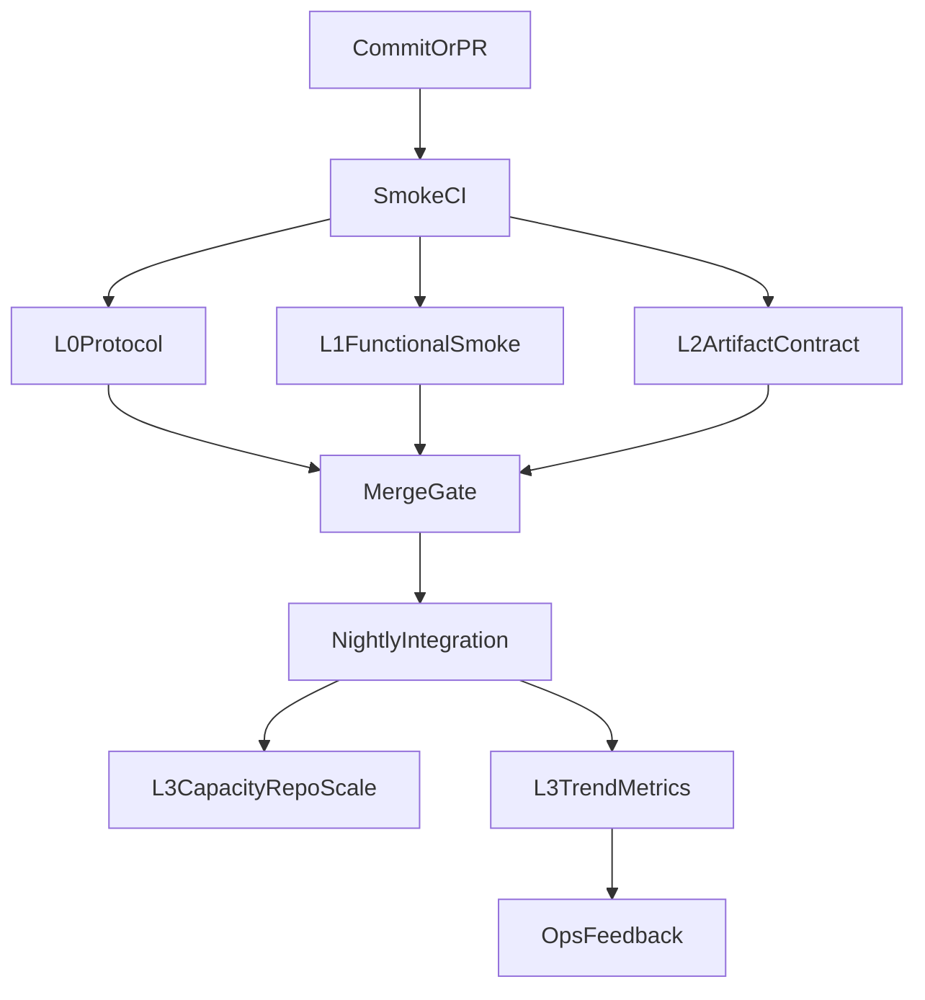

# PointerGPF MCP Testing Specification

## 1. Baseline Evidence

当前仓库已具备三类可复用测试资产：

- CI 冒烟：`.github/workflows/mcp-smoke.yml`
  - 覆盖 `install/install-mcp.ps1`
  - 覆盖 CLI `get_mcp_runtime_info`
  - 覆盖 stdio 协议 `initialize` + `tools/list`
  - 覆盖最小样本 `init_project_context` + `generate_flow_seed`
- CI 集成：`.github/workflows/mcp-integration.yml`
  - 覆盖仓库规模 `init_project_context --max-files 2500`
  - 覆盖仓库规模 `generate_flow_seed`
- 本地矩阵：`scripts/verify-cross-project.ps1`
  - 示例项目 + 真实项目双矩阵串行验证

相关规范/检查项分散在：

- `README.md`
- `docs/quickstart.md`
- `docs/migration-checklist.md`
- `docs/mcp-implementation-status.md`

## 2. Gap Analysis And Severity

### P0 (Must Fix)

- 协议层断言不足：`smoke` 未覆盖 `tools/call` 成功与失败路径。
- 契约负例不足：未验证非法工具名、非法 `arguments` 类型、缺失必填参数的错误语义。

### P1 (Should Fix)

- 产物质量断言不足：`integration` 仅执行命令，缺少对 `index.json` 与 seed flow 结构断言。
- 本地脚本可移植性不足：`verify-cross-project.ps1` 默认真实项目路径硬编码。

### P2 (Can Improve)

- 文档口径分散：测试层级、预算、失败处理策略不集中。
- 趋势数据不足：nightly 未沉淀结构化耗时/失败阶段输出。

## 3. Target Test Flow

### L0 Protocol (PR Required)

- stdio `initialize` 成功
- stdio `tools/list` 返回关键工具
- stdio `tools/call` 正向调用成功
- stdio `tools/call` 负向调用返回可预期 JSON-RPC 错误

### L1 Functional Smoke (PR Required)

- `install-mcp.ps1`
- Python 契约（`mcp-smoke`）：`python -m unittest tests.test_natural_language_basic_flow_commands tests.test_flow_execution_runtime tests.test_bug_auto_fix_loop`
- `get_mcp_runtime_info`
- `init_project_context`（最小样本）
- `generate_flow_seed`（最小样本）
- Figma 协同最小样本：
  - `figma_design_to_baseline`
  - `compare_figma_game_ui`
  - `annotate_ui_mismatch`
  - `approve_ui_fix_plan`
  - `suggest_ui_fix_patch`

### L2 Artifact Contract (PR Required)

- `project_context/index.json` 存在并包含关键字段
- `generated_flows/<flow_id>.json` 存在并符合 chat contract 最小契约
- `design_game_basic_test_flow` 生成结果必须包含 `generation_evidence`，并满足：
  - `candidate_counts.action_filtered >= 1` 时允许 `status=generated`
  - `candidate_counts.action_filtered = 0` 时必须 `status=blocked` 且 `flow_file=""`
- `gpf-exp/runtime/` 目录存在且包含运行时产物
- 若启用 Figma 协同链路：`compare/annotate/approval/suggestion` 报告存在且 `run_id` 一致
- **执行层验证（非仅 seed/smoke）**：在具备文件桥与运行中游戏的前提下，应对 `run_game_basic_test_flow` 的落地结果做校验；推荐在 CI 或本地通过 `scripts/assert-mcp-artifacts.ps1` 的 **`-ValidateExecutionPipeline`** 断言执行报告、事件流与三阶段（`started` / `result` / `verify`）覆盖，而不是只确认 `generate_flow_seed` 或“命令曾成功退出”。
- 执行报告必须断言以下字段：
  - `runtime_mode=play_mode`
  - `input_mode=in_engine_virtual_input`
  - `os_input_interference=false`
  - `runtime_gate_passed=true`
  - `step_broadcast_summary.protocol_mode=three_phase`
  - `step_broadcast_summary.fail_fast_on_verify=true`
  - `project_close.requested=true`
  - `project_close.acknowledged=true`（成功路径）
- 对“流程结束后运行态”的断言要求：
  - 允许编辑器进程保留；
  - 必须确认 Play 运行态已停止（例如 `runtime_gate.json.runtime_mode=editor_bridge`）。
- 门禁失败路径必须断言以下字段：
  - `error.code=RUNTIME_GATE_FAILED`
  - `details.blocking_point` 存在
  - `details.next_actions` 为非空数组
  - `details.engine_bootstrap.target_project_root` 与请求 `project_root` 一致
  - `details.engine_bootstrap.selected_executable` 字段存在
  - `details.engine_bootstrap.launch_process_id` 字段存在
- shell 播报必须断言以下格式：
  - 每个阶段第一行为 `[GPF-FLOW-TS] YYYY-MM-DD T HH:MM:SS`（本地系统时间）
  - 每个阶段第二行为中文语义行（`开始执行` / `执行结果` / `验证结论`）
  - 不得出现 `run=`、`phase=`、`id=`、`action=`、`bridge_ok=`、`verified=` 技术字段行
- 双结论必须断言以下一致性：
  - `tool_usability.passed=true` 仅表示协议层可用
  - `gameplay_runnability.passed=true` 必须同时满足 `runtime_mode=play_mode`、`runtime_gate_passed=true`、`input_mode=in_engine_virtual_input`、`os_input_interference=false`
- 动作后状态断言策略：
  - 对由交互动作触发的 UI 状态变化，优先使用 `wait + until.hint`（短超时轮询）而非同帧 `check`，避免时序误报。

### L3 Capacity And Trend (Nightly/Manual)

- 仓库规模上下文初始化与 seed 生成
- 沉淀结构化指标（耗时、阶段、状态）供趋势追踪

### L4 Cross-Project Matrix (Local Recommended)

- 示例项目 + 真实项目
- 对真实项目路径采用显式参数或环境变量，不允许硬编码默认值

## 4. Failure Policy

- PR 阶段：L0/L1/L2 任一失败 -> 阻断合并
- Nightly 阶段：L3 失败 -> 不阻断开发流，但必须输出失败阶段与错误摘要
- 本地矩阵：用于发布前验证与问题复现，不替代 CI gate

## 5. Ownership

- Workflow 维护：仓库维护者
- 契约字段变更：`mcp/server.py` 维护者
- 文档同步：发布责任人（版本升级与测试策略更新时必须同步）

## 6. Acceptance Criteria

- 能明确回答：每层测什么、何时触发、失败是否阻断
- 每个关键工具具备至少 1 条成功 + 1 条失败自动化断言
- 文档描述与 CI 实际行为一致

## 7. Minimal Rollout Sequence

1. 先增强 `.github/workflows/mcp-smoke.yml` 的协议断言（补 `tools/call` 正负例）。
2. 增加 `scripts/assert-mcp-artifacts.ps1`，并在 smoke/integration 中接入。
3. 调整 `scripts/verify-cross-project.ps1`，移除真实项目硬编码默认路径。
4. 同步 `README.md`、`docs/quickstart.md`、`docs/migration-checklist.md`、`docs/mcp-implementation-status.md`。
5. nightly 输出并上传趋势报告 artifact，供后续外部看板聚合。
